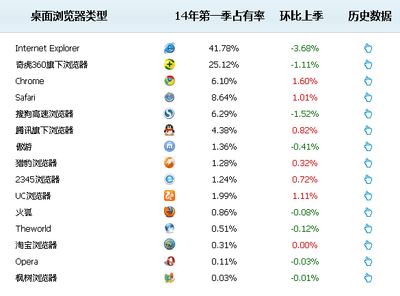

1. SSH
      * recover home_main.html
          *  ```
            cp -f umei_bak/view/public/room_main.html umei/view/public/room_main.html 
            ```
2. YUI Doc
      * inside of docs directory run 
        *   ```
            yuidocsite --port 3000 
            ```
        * go to site url in browser
            * http://localhost:3000 
3. Auth
      * 登录名 zhangsir     ID 32087834
        密码：1qa2ws
        anchor for actual environment
        medusa
        Qqq111
      * server connection
        * http://svn.uumie.cn:666/web
      * svn sync, connect to 182.92.175.233
      
      ```        
      cd /data/www/web
      svn up
      ```          
4. Build
      * build based on grunt tech
      
      ```
      npm install
      ```
        
      * generate built front-end code
      
      ```
      grunt build:test
      ```
      
      * other: generate 'yuidoc', 'readme', 'plato'
      
      ```
      grunt or grunt default
      ```
5. localhost config, refs[1](http://blog.163.com/fan_xy_qingyuan/blog/static/1889877482014111111283265/),[2](http://www.phperz.com/article/14/1029/31985.html)
      * install and run redis server
          *  
             ```
             cd E:\yii\redis
             redis-server.exe redis.conf 
             ```
6. Browsers compatibility: the first six
      * 